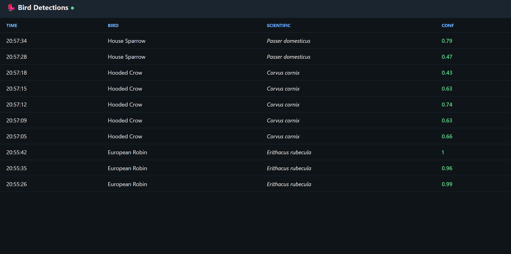
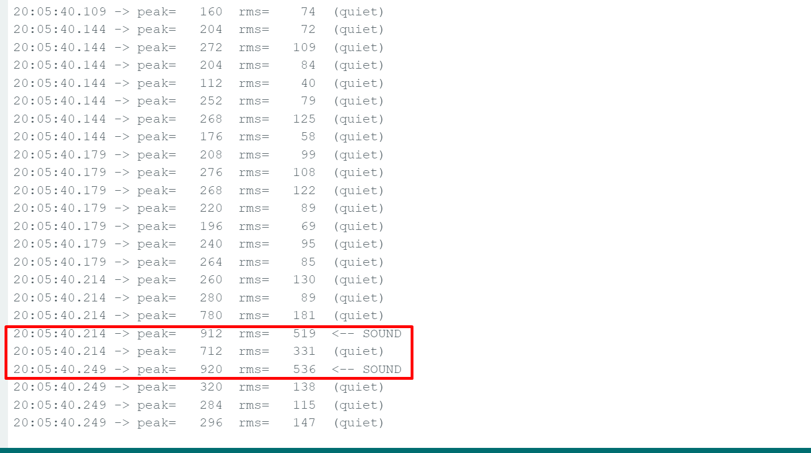
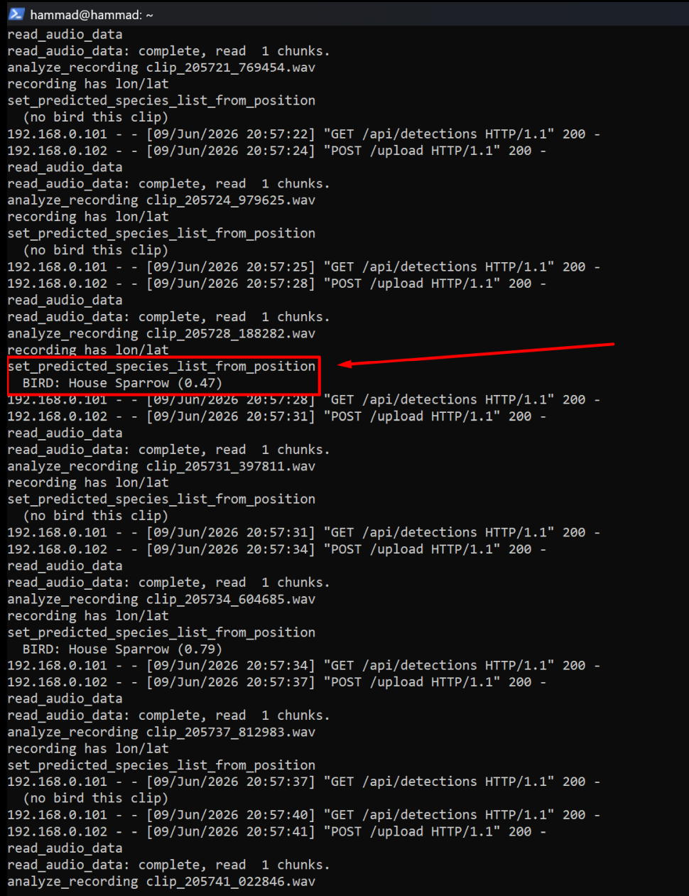

# 🐦 BirdNET Field Detector

Real-time bird sound detection over WiFi. An **ESP32-S3** with an I²S microphone streams audio to a **Raspberry Pi 4**, which runs **BirdNET** to identify species and serves a live web dashboard you can open from any device on the same network.

Deploy the sensor outdoors, sit indoors, and watch detected birds — with species name, scientific name, confidence score, and timestamp — appear in your browser in real time.

---

## Table of Contents

- [Architecture](#architecture)
- [Hardware](#hardware)
- [Wiring](#wiring)
- [Repository Layout](#repository-layout)
- [Prerequisites](#prerequisites)
- [Setup — Raspberry Pi (Server)](#setup--raspberry-pi-server)
- [Setup — ESP32-S3 (Firmware)](#setup--esp32-s3-firmware)
- [Running the System](#running-the-system)
- [Auto-Start on Boot](#auto-start-on-boot)
- [The Dashboard](#the-dashboard)
- [Configuration Reference](#configuration-reference)
- [Troubleshooting](#troubleshooting)
- [Known Constraints](#known-constraints)
- [Roadmap](#roadmap)

---

## Architecture

```
┌──────────────┐   I²S    ┌──────────────┐   WiFi (HTTP)   ┌──────────────────┐
│  ICS-43434   │ ───────► │  ESP32-S3    │ ──────────────► │  Raspberry Pi 4  │
│  MEMS mic    │  audio   │  (firmware)  │   3s WAV clips  │  Flask + BirdNET │
└──────────────┘          └──────────────┘                 └────────┬─────────┘
                                                                     │ HTTP
                                                                     ▼
                                                            ┌──────────────────┐
                                                            │  Web Dashboard   │
                                                            │  (any browser on │
                                                            │   the same LAN)  │
                                                            └──────────────────┘
```

**Pipeline:**

1. The ICS-43434 microphone produces 24-bit audio on the I²S bus.
2. The ESP32-S3 captures rolling **3-second clips** at 48 kHz, wraps them as 16-bit mono WAV, and `POST`s each clip to the Pi over WiFi.
3. A Flask server on the Pi receives each clip, queues it, and runs **BirdNET** (via `birdnetlib`) to detect species, filtered by geographic location.
4. Detections are appended to an in-memory list and `detections.csv`, and exposed through a JSON API.
5. A self-refreshing web dashboard polls the API and displays detections live.

> **Note:** BirdNET runs on the Raspberry Pi, **not** on the ESP32-S3. The ESP32 is purely an audio capture-and-stream device. The Pi does all inference.

---


## Screenshots

### Live Dashboard
Detected birds appear in real time with species, scientific name, confidence, and timestamp.



### ESP32-S3 Serial Monitor
The firmware captures and streams 3-second audio clips continuously over WiFi.



### Raspberry Pi Server Log
BirdNET analyzes each incoming clip and reports detections.



## Hardware

| Component            | Model / Spec                          | Notes                                          |
| -------------------- | ------------------------------------- | ---------------------------------------------- |
| Microcontroller      | ESP32-S3 (dev board)                  | 2.4 GHz WiFi; I²S microphone interface         |
| Microphone           | ICS-43434 (I²S MEMS)                   | 24-bit; wiring identical to INMP441            |
| Server               | Raspberry Pi 4                        | Running **64-bit** Raspberry Pi OS             |
| Power (field)        | 2× USB power bank                     | One for the Pi, one for the ESP32              |
| Network              | TP-Link router (2.4 GHz WiFi)         | Both devices on the same LAN                   |

---

## Wiring

ICS-43434 → ESP32-S3. The `SEL` pin is tied to **GND** to select the **left** I²S channel.

| Mic Pin | ESP32-S3 GPIO | Purpose                  |
| ------- | ------------- | ------------------------ |
| SEL     | GND           | Channel select (LEFT)    |
| LRCL    | GPIO 17       | Word select / L-R clock  |
| DOUT    | GPIO 18       | Serial data out          |
| BCLK    | GPIO 8        | Bit clock                |
| GND     | GND           | Ground                   |
| 3V      | 3V3           | Power                    |

> If you change these GPIO assignments, update the `#define` values at the top of the firmware to match.

---

## Repository Layout

> Adjust to match your actual file names.

```
.
├── firmware/
│   ├── mic_test/              # Stage 1: serial-only mic test (no WiFi)
│   └── streamer/              # Production: streams 3s clips to the Pi
├── server/
│   └── app.py                 # Flask server + BirdNET analyzer + dashboard
├── tools/
│   └── test_receiver.py       # Local PC receiver for end-to-end transport testing
├── docs/
│   └── screenshots/           # Dashboard / serial / server reference images
└── README.md
```

---

## Prerequisites

**Development machine (PC):**

- [Arduino IDE 2.x](https://www.arduino.cc/en/software) with the **ESP32 board package** (Arduino-ESP32 core **3.x** — required for the modern `i2s_std` driver)
- Python 3 (only if running the local `test_receiver.py`)

**Raspberry Pi:**

- **Raspberry Pi OS (64-bit)** — ⚠️ 32-bit will **not** work (TensorFlow Lite has no 32-bit wheels)
- Network access on the same LAN as the ESP32

---

## Setup — Raspberry Pi (Server)

SSH into the Pi from your PC:

```bash
ssh <user>@<pi-ip>
```

### 1. System dependencies

```bash
sudo apt update
sudo apt install -y python3-venv python3-dev ffmpeg libsndfile1
```

> `libatlas-base-dev` is **not** required on recent Pi OS releases (it has been dropped from the repos, and TensorFlow bundles its own math routines).

### 2. Python environment

Recent Pi OS enforces [PEP 668](https://peps.python.org/pep-0668/), so a virtual environment is mandatory:

```bash
python3 -m venv ~/birdnet-env
source ~/birdnet-env/bin/activate
pip install --upgrade pip
pip install flask birdnetlib librosa
pip install tensorflow
```

The `tensorflow` install is large and may take **5–15 minutes** on a Pi 4.

### 3. Python 3.13 compatibility fix (important)

If your Pi OS ships **Python 3.13**, TensorFlow will fail to import with:

```
ModuleNotFoundError: No module named 'imp'
```

This is because the bundled `flatbuffers` relies on the `imp` module, which was removed in Python 3.12+. Force-install a newer `flatbuffers`:

```bash
python -m pip install --force-reinstall "flatbuffers==25.2.10"
```

Verify the fix:

```bash
python -c "import flatbuffers, flatbuffers.compat; print('flatbuffers OK')"
```

You should see `flatbuffers OK`.

### 4. Deploy the server

Place `app.py` in the Pi's home directory (`~/app.py`). Open it and set your deployment location for accurate, region-filtered species detection:

```python
LAT, LON = 60.17, 24.94     # <-- set to your field location (default: Helsinki)
MIN_CONF = 0.30             # <-- minimum confidence to report a detection
```

---

## Setup — ESP32-S3 (Firmware)

1. Open the streamer sketch in Arduino IDE.
2. Set **Tools → Board → ESP32S3 Dev Module**.
3. Set **Tools → USB CDC On Boot → Enabled** (required for serial output on the S3).
4. Edit the configuration block at the top of the sketch:

```cpp
const char* WIFI_SSID = "<your-2.4GHz-ssid>";   // 2.4 GHz network ONLY
const char* WIFI_PASS = "<your-wifi-password>";
const char* PI_HOST   = "<pi-ip>";              // e.g. 192.168.0.107
const int   PI_PORT   = 5000;                   // 5000 = production server
#define TEST_MODE     false                     // false = continuous; true = single clip
```

5. Click **Upload**. If upload hangs on *"Connecting…"*, hold **BOOT**, tap **RESET**, release **BOOT**, and upload again.
6. Open the Serial Monitor at **115200 baud** to confirm operation.

### Staged bring-up (recommended for first-time setup)

The firmware supports an incremental verification path. Each stage proves the previous one works:

| Stage | What it proves                       | How                                                                 |
| ----- | ------------------------------------ | ------------------------------------------------------------------- |
| 1     | Microphone captures audio            | Flash `mic_test`; clap near the mic; `peak`/`rms` should spike      |
| 2     | Clips travel over WiFi               | Run `tools/test_receiver.py` on your PC; set `PI_PORT=5001`, `TEST_MODE=true`; a `.wav` should be saved and playable |
| 3     | End-to-end detection                 | Point firmware at the Pi (`PI_PORT=5000`, `TEST_MODE=false`); play a bird call near the mic |

---

## Running the System

**1. Start the server on the Pi:**

```bash
source ~/birdnet-env/bin/activate
python ~/app.py
```

Wait for:

```
Model ready.
 * Running on http://0.0.0.0:5000
```

Leave this session running (or use the [auto-start service](#auto-start-on-boot) below).

**2. Power on the ESP32.** It connects to WiFi and begins streaming automatically — no re-flashing needed unless the code changes. The Serial Monitor will loop:

```
WiFi connected: 192.168.0.xxx
Streaming 3s clip...
Clip sent.
```

**3. Open the dashboard** in any browser on the same LAN:

```
http://<pi-ip>:5000
```

When a bird is detected, the Pi logs `BIRD: <name> (0.xx)` and a row appears on the dashboard within seconds. Quiet periods log `(no bird this clip)` — this is normal.

---

## Auto-Start on Boot

To run the server automatically on every Pi boot (no SSH session required) — recommended for unattended field deployment.

Create the service:

```bash
sudo nano /etc/systemd/system/birdnet.service
```

```ini
[Unit]
Description=BirdNET bird detection server
After=network-online.target
Wants=network-online.target

[Service]
User=<user>
WorkingDirectory=/home/<user>
ExecStart=/home/<user>/birdnet-env/bin/python /home/<user>/app.py
Restart=always
RestartSec=5

[Install]
WantedBy=multi-user.target
```

Enable and start it:

```bash
sudo systemctl daemon-reload
sudo systemctl enable birdnet.service
sudo systemctl start birdnet.service
sudo systemctl status birdnet.service   # expect: active (running)
```

**Service management:**

| Action              | Command                                      |
| ------------------- | -------------------------------------------- |
| Live detection logs | `journalctl -u birdnet.service -f`           |
| Stop                | `sudo systemctl stop birdnet.service`        |
| Start               | `sudo systemctl start birdnet.service`       |
| Disable auto-start  | `sudo systemctl disable birdnet.service`     |

---

## The Dashboard

A single self-contained page served at `http://<pi-ip>:5000`. It polls `/api/detections` every 3 seconds and displays a live, newest-first table:

| Column      | Description                          |
| ----------- | ------------------------------------ |
| Time        | Detection timestamp (`HH:MM:SS`)     |
| Bird        | Common name                          |
| Scientific  | Scientific name                      |
| Conf        | Model confidence (0.00–1.00)         |

### API

| Endpoint            | Method | Description                                            |
| ------------------- | ------ | ------------------------------------------------------ |
| `/`                 | GET    | The dashboard web page                                 |
| `/upload`           | POST   | Receives a WAV clip (raw body) from the ESP32          |
| `/api/detections`   | GET    | JSON array of recent detections (newest first, max 200)|

Detections are also persisted to `detections.csv` in the server's working directory, and raw clips are saved under `clips/`.

---

## Configuration Reference

### Firmware (`streamer`)

| Define         | Default | Description                                         |
| -------------- | ------- | --------------------------------------------------- |
| `SAMPLE_RATE`  | `48000` | I²S sample rate (Hz)                                |
| `GAIN`         | `4`     | Software gain multiplier; raise if audio is too quiet|
| `TEST_MODE`    | `false` | `true` sends one clip then stops; `false` loops      |
| `I2S_WS`       | `17`    | Word-select GPIO (→ LRCL)                            |
| `I2S_SD`       | `18`    | Data GPIO (→ DOUT)                                   |
| `I2S_SCK`      | `8`     | Bit-clock GPIO (→ BCLK)                              |
| `CLIP_SECONDS` | `3`/`5` | 3s in production, 5s in test mode                   |

### Server (`app.py`)

| Variable     | Default       | Description                                       |
| ------------ | ------------- | ------------------------------------------------- |
| `LAT`, `LON` | `60.17, 24.94`| Deployment coordinates for species filtering      |
| `MIN_CONF`   | `0.30`        | Minimum confidence threshold for reporting        |
| `CLIP_DIR`   | `clips`       | Directory for saved WAV clips                     |
| `CSV_FILE`   | `detections.csv` | Detection log file                             |

---

## Troubleshooting

| Symptom                                              | Likely cause / fix                                                                                              |
| ---------------------------------------------------- | -------------------------------------------------------------------------------------------------------------- |
| `peak`/`rms` stuck near 0 in mic test                | Check BCLK (8), LRCL (17), DOUT (18) wiring; reseat SEL→GND and DOUT jumpers.                                   |
| Audio detected but very quiet                        | Increase firmware `GAIN` (e.g. `4` → `8` or `16`) and re-flash.                                                 |
| Serial: `connect FAILED`                             | ESP32 is 2.4 GHz only — confirm it's on a 2.4 GHz SSID. Open the server port on the Pi: `sudo ufw allow 5000`.  |
| `ModuleNotFoundError: No module named 'imp'`         | Python 3.13 issue — force-reinstall `flatbuffers==25.2.10` (see setup step 3).                                  |
| `Package libatlas-base-dev has no installation candidate` | Harmless — omit it; it's not needed on recent Pi OS.                                                       |
| `error: externally-managed-environment` from pip     | You're outside the venv — run `source ~/birdnet-env/bin/activate` first.                                        |
| Dashboard won't load                                 | Verify the URL includes `:5000` and the Pi IP is correct; confirm the server is running.                       |
| Dashboard always shows "Listening…"                  | No birds above threshold yet. Test with a loud, clear bird call near the mic; lower `MIN_CONF` if needed.       |
| Pi IP changed after reboot                            | Set a **DHCP Address Reservation** in the router so the Pi keeps a fixed IP.                                    |

### Copying files off the Pi

From a **PC** terminal (not an SSH session into the Pi):

```bash
scp <user>@<pi-ip>:~/app.py .
scp <user>@<pi-ip>:~/detections.csv .
scp -r <user>@<pi-ip>:~/clips ./clips
```

---

## Known Constraints

- **ESP32-S3 WiFi is 2.4 GHz only.** It cannot join 5 GHz networks.
- **Raspberry Pi OS must be 64-bit** for TensorFlow Lite / BirdNET to install.
- **Same-LAN access only** by default. The dashboard is reachable from any device on the home WiFi, but not from outside the network without additional setup (see Roadmap).
- **Fixed Pi IP recommended.** Both the firmware (`PI_HOST`) and your dashboard bookmark depend on a stable Pi address — use a router DHCP reservation.
- **Detection accuracy depends on audio quality.** Distance, wind, and microphone gain all affect results. Set `LAT`/`LON` accurately to constrain species to plausible candidates for your region.

---

## Roadmap

- [ ] Remote access from outside the home network (e.g. Tailscale)
- [ ] Store and play back detection audio clips from the dashboard
- [ ] Charts and historical analytics (detections per species / per hour)
- [ ] Multiple ESP32 sensors reporting to one Pi
- [ ] Production WSGI server (the current Flask dev server is for local/LAN use)
- [ ] Weatherproof enclosure and power-management notes for long-term field deployment

---

## Acknowledgements

- [BirdNET](https://birdnet.cornell.edu/) — Cornell Lab of Ornithology & Chemnitz University of Technology
- [`birdnetlib`](https://pypi.org/project/birdnetlib/) — Python interface to BirdNET
